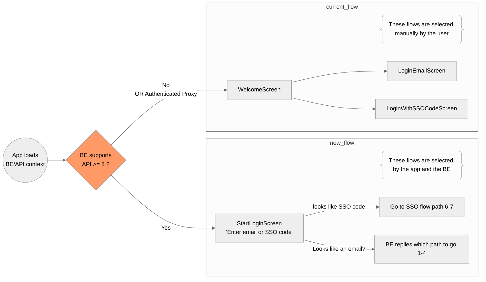

# 6. Simplified enterprise login

Date: 2025-01-23

## Status

Accepted

## Context

Starting (potentially) from Android 4.12.x the app will support the new enterprise login flows, this means in practice that the app needs to support both flows current/old.

### The current flow (old)

Customers configure their setup manually in their backend.
The user experience for this makes the user selects manually which flow they must use by going to the correct screens, i.e. going to the tab and select login with SSO code, or login with email, or use a deeplink to load the on premise configuration, and then select the correct flow.

### The new flow

Customers, via team settings and Back-office tools, will be able to load this config to facilitate the decision of which flow the user must use. This will make the app, in conjunction with the backend, decide for the user which path/flow they must use to login by just having one input field, “email or SSO code”.
The adoption won’t be automatically via deprecation, hence the need to support both flows for some time. To clarify a bit how this looks in practice for the code we have, how this will be implemented, a high level look of the two flows living together, the following diagram can be used.

## Decision

We will keep both flows, the current as-is and the new one, being the app able to decide which one to use based on the configuration received from the backend.

## Consequences

- The code base will have some duplication for some time, but this will be removed when the old flow is deprecated.
- To select the correct flow, the app will need to load the BE context, based on the API version, and then decide which flow to use.
- The navigation, entry point will need to be dynamic, based on the flow selected.
