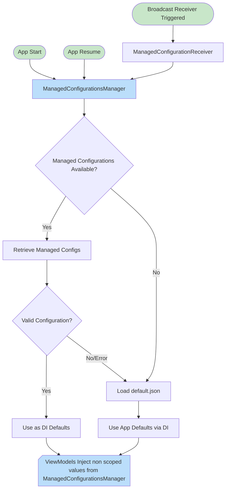

# 7. Introducing Enterprise Mobility Management (EMM) Capabilities

Date: 2025-10-15

## Status

Accepted

## Context

As a requirement for some of our business cases, we need to introduce Enterprise Mobility Management (EMM) capabilities into our Android application. EMM solutions help organizations manage and secure mobile devices, applications, and data.
To implement EMM capabilities, we want to add support for the following features:
- Backend setup using managed configurations, the ability for the app to connect by default to a specific backend.
- SSO Capabilities, allowing users to authenticate with a default sso code configuration.

## Decision

This was implemented by following the guidelines provided by Google for adding EMM capabilities to Android applications. The steps taken were:
1. **Manifest Changes**: Updated the AndroidManifest.xml to include the necessary permissions and metadata
2. **Managed Configurations**: Implemented support for managed configurations to allow IT administrators to configure the app remotely.
3. **SSO Integration**: Integrated SSO capabilities to allow seamless authentication for users within an enterprise environment.
4. **Testing**: Conducted thorough testing to ensure that the EMM features work as

## Consequences

- The app now support EMM capabilities, by making use of `RestrictionsManager` component to retrieve managed configurations and apply them accordingly.
- The app reads the managed configurations and applies them to set the default backend and SSO settings.
- The app resolves using DI the backend and SSO settings from the managed configurations if available, otherwise it falls back to the app default settings.

