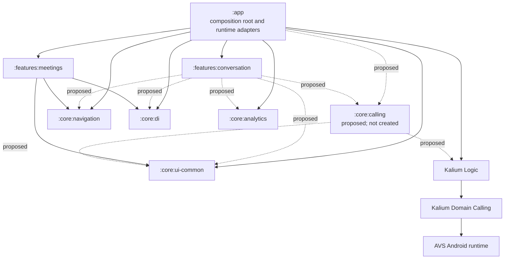

# Android module dependency graph

**Owner:** `TODO: Android architecture owner`

**Last verified:** 2026-08-23, `chore/android-modularization`, HEAD `4f249fba79616d5bee035d0da081079b426c233c`.

`A --> B` means **A declares or uses B**. Solid edges are verified current
declared edges. Dashed edges are proposed, including all current-empty
`:features:conversation` outbound edges. The canonical target diagram source is
[`android-module-graph.mmd`](android-module-graph.mmd); its body is embedded
verbatim below.



## Verified current declared edges

| From | To | Scope | Status | Reason | Allowed rule |
|---|---|---|---|---|---|
| `:app` | `:features:conversation` | `implementationWithCoverage` | current | Composition of the empty conversation spine | App may depend on a feature |
| `:app` | `:features:meetings` | `implementationWithCoverage` | current | Composition | App may depend on a feature |
| `:app` | `:core:navigation`, `:core:di`, `:core:ui-common` | implementation / coverage helper | current | Android runtime composition | Allowed |
| `:app` | Kalium Logic | implementation coordinate | current | Application runtime | Allowed |
| `:features:meetings` | `:core:di`, `:core:navigation`, `:core:ui-common`, `:core:search` | implementation | current | Existing feature dependencies | Feature to core only |
| `:core:navigation` | `:core:navigation-kmp`, `:core:design-system`, `:core:ui-common` | api / implementation | current | Navigation primitives | Core to core only |
| `:core:ui-common` | `:core:design-system`, `:core:interaction-model`, `:core:di` | api / implementation | current | Shared Android UI primitives | Core to core only |
| Kalium Logic | Kalium Domain Calling | api | current | Kalium calling domain | Kalium-owned edge |
| Kalium Domain Calling | AVS Android runtime | Android `api` | current | AVS platform binding | Kalium-owned edge |
| `:app` | `:core:analytics-enabled` or `:core:analytics-disabled` | flavor implementation | current | App selects analytics runtime by flavor | Runtime adapter only |

The source paths and Gradle declarations above were verified with:

```text
git branch --show-current
git rev-parse HEAD
rg -n 'implementationWithCoverage\(projects\.features|projects\.(core|features)' app/build.gradle.kts features/meetings/build.gradle.kts
sed -n '1,120p' core/navigation/build.gradle.kts
sed -n '1,120p' core/ui-common/build.gradle.kts
sed -n '1,120p' kalium/domain/calling/build.gradle.kts
sed -n '1,140p' kalium/logic/build.gradle.kts
```

## Source-only temporary seams

These are not Gradle edges and must not be mistaken for module ownership:

| Seam | Evidence | Required disposition |
|---|---|---|
| Conversation/calling/meetings host Metro hub | `ui/calling/CallingManualViewModelFactoryGroup.kt` imports conversation, list, and app meetings-host view models; `CallingMetroViewModelBindings.kt` binds the latter two | Split assembly ownership before terminal move; preserve Metro groups, keys, and scopes |
| Conversation calling flow used by meetings host | `ui/home/meetings/MeetingsCallViewModel.kt` imports `JoinOrStartCallManager` and `ObserveParticipantsForConversationUseCase` | Extract only the neutral call coordinator and a narrow participant-count port |
| Navigation runtime consumes feature contracts | `navigation/runtime/WireNavigation3Contributions.kt`, `WireNavigation3ProductionActions.kt`, and `navigation/routes/media/MediaNavigation3Entries.kt` import conversation/meetings contracts | App remains the Navigation3 runtime adapter; features export route/contribution contracts |
| Meetings legacy conversation-list names | meetings imports `Membership` and group avatar package names, but the declarations are physically in `:core:ui-common` | Keep them in `:core:ui-common`; legacy package names are not module ownership |

Audited production-file counts are: conversations **250**, message composer **41**,
conversations list **27**, gallery **6**, calling **60**, and feature meetings
**27**. The strict conversations directory has **59** unit tests and **1** Android
test; **85** files import app `R`, **428** distinct fully-qualified `R.type.name`
IDs occur there, and **7** files use `BuildConfig`. The temporary source SCC is conversation,
message-composer, conversations-list, gallery, calling, and the app meetings host;
the existing `:features:meetings` module is not in that SCC.

Reproduce the counts with:

```text
for p in app/src/main/kotlin/com/wire/android/ui/home/conversations app/src/main/kotlin/com/wire/android/ui/home/messagecomposer app/src/main/kotlin/com/wire/android/ui/home/conversationslist app/src/main/kotlin/com/wire/android/ui/home/gallery app/src/main/kotlin/com/wire/android/ui/calling features/meetings/src/main/java; do find "$p" -type f -name '*.kt' | wc -l; done
find app/src/test/kotlin/com/wire/android/ui/home/conversations -type f -name '*.kt' | wc -l
find app/src/androidTest/kotlin/com/wire/android/ui/home/conversations -type f -name '*.kt' | wc -l
rg -l 'com\.wire\.android\.R|import com\.wire\.android\.R' app/src/main/kotlin/com/wire/android/ui/home/conversations --glob '*.kt' | wc -l
rg --no-filename -o 'R\.[A-Za-z0-9_]+\.[A-Za-z0-9_]+' app/src/main/kotlin/com/wire/android/ui/home/conversations --glob '*.kt' | sort -u | wc -l
rg -l 'BuildConfig' app/src/main/kotlin/com/wire/android/ui/home/conversations --glob '*.kt' | wc -l
```

## Target rules and proposed edges

| From | To | Scope | Status | Reason | Allowed rule |
|---|---|---|---|---|---|
| `:app` | `:core:calling` | implementation | proposed | App owns call activities, intents, services, and assembly adapters | Allowed when the module exists |
| `:features:conversation` | `:core:calling` | implementation; `api` only for public Kalium types | proposed | Shared call coordinator/contracts | Allowed when the module exists |
| `:features:conversation` | `:core:analytics` | implementation | proposed | Feature consumes analytics interface/event model | Allowed |
| `:core:calling` | `:core:ui-common`, Kalium Logic | implementation; Kalium `api` only if exposed | proposed | Neutral coordinator needs shared UI state and calling use cases | No app/feature edge |
| `:features:meetings` | `:core:calling` | none currently | conditional | Add only if meetings itself later owns calling state | Never route via conversation |
| any `:features:*` | `:app` | any | forbidden | App is not reusable domain owner | Boundary test enforces |
| any `:features:*` | any other `:features:*` | any | forbidden | Independent features share through neutral core/platform | Boundary test enforces |
| `:core:calling` | `:app` or any feature | any | forbidden | Neutral shared module | Future module test required |

### Shared ownership rule

Place a declaration in a neutral core/platform module only when a stable source
contract or implementation has at least two independent consumers. A common
third-party dependency alone does not justify a wrapper.

- `JoinOrStartCall*` is used by conversation and the meetings flow: extract the
  neutral coordinator to proposed `:core:calling`. Its participant-count input
  must be a narrow port; do not move the conversation participant-details use
  case wholesale.
- `Membership`, `ChannelConversationAvatar`, and
  `RegularGroupConversationAvatar` are already shared in `:core:ui-common` and
  stay there despite legacy `ui.home.conversationslist` package names.
- `AnonymousAnalyticsManager` and `AnalyticsEvent` stay in `:core:analytics`.
  Flavor-specific `AnonymousAnalyticsManagerImpl` remains an app runtime choice;
  feature code must not depend on that implementation.
- Call activities/intents, `ServicesManager`, `CallService`, audio services, and
  AVS renderers remain app Android adapters. They are not core or feature APIs.

Dependency budgets: a feature may depend on the smallest required core modules and
Kalium APIs, never app or another feature. Proposed `:core:calling` may depend on
Kalium Logic and `:core:ui-common` only as proved by the moved coordinator; it has
zero budget for app, feature, Navigation3 runtime, services, or AVS dependencies.

## Update protocol and migration gates

The owner updates this document and the canonical `.mmd` file in the same change
as every module-edge change, refreshes the verified HEAD/date and commands, and
keeps the boundary test aligned with existing modules only.

1. Keep the feature spine and graph guard green.
2. Extract the neutral call coordinator and narrow participant-count port.
3. Split app Metro/runtime assembly from conversation/list/meetings-host view
   models without changing binding/group semantics.
4. Prepare Navigation3 host adapters and produce an exact resource-ID ownership
   manifest.
5. Move the conversation SCC and its audited closure; app retains only
   composition/runtime adapters.

Stop rather than broadening a move when a proposed shared type needs an app or
feature dependency, a Metro scope/key cannot be preserved, a route/result requires
a feature-to-feature edge, or a resource/BuildConfig owner cannot be proven. Do not
create `:core:calling` merely because calling and another feature share Kalium.
