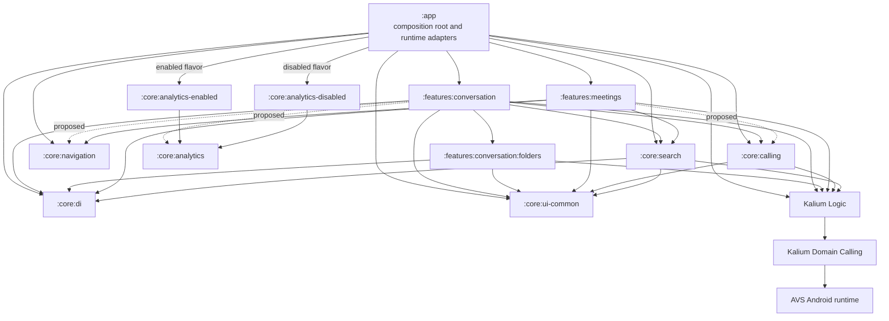

# Android module dependency graph

**Owner:** `TODO: Android architecture owner`

**Last verified:** 2026-08-24, `chore/android-modularization`, baseline HEAD `1d90e9f228b4642a1afaeaf11865571a9b1dd03b`.

`A --> B` means **A declares or uses B**. Solid edges are verified current
declared edges. Dashed edges are proposed. The canonical target diagram source is
[`android-module-graph.mmd`](android-module-graph.mmd); its body is embedded
verbatim below.



## Verified current declared edges

| From | To | Scope | Status | Reason | Allowed rule |
|---|---|---|---|---|---|
| `:app` | `:features:conversation` | `implementationWithCoverage` | current | Composition and runtime assembly | App may depend on a feature |
| `:features:conversation` | `:features:conversation:folders` | api + kover | current | Re-export the first internal conversation capability while preserving facade-only app access | Facade to internal capability only |
| `:features:conversation:folders` | `:core:ui-common` | api | current | Public folder state and UI text contracts use shared UI-common types | Internal capability to neutral core only |
| `:features:conversation:folders` | `:core:di` | implementation | current | Folder ViewModel markers and Metro gateway helpers | Internal capability to neutral core only |
| `:features:conversation:folders` | Kalium Logic | api | current | Folder state, IDs, and use cases expose Kalium types | Internal capability to Kalium only |
| `:features:conversation` | `:core:ui-common` | api | current | Public participant projection exposes UI-common avatar and membership types | Feature to core only |
| `:features:conversation` | `:core:calling` | api | current | The public `ConversationCallViewModel.callManager` surface exposes the neutral calling coordinator | Feature to core only; public ABI requires `api` |
| `:features:conversation` | `:core:di` | implementation | current | Feature-owned ViewModel markers and Metro gateway helpers | Feature to core only |
| `:features:conversation` | `:core:search` | implementation | current | Participant renderers use neutral query highlighting widgets | Feature to core only |
| `:features:conversation` | Kalium Logic | api | current | Public participant and typing contracts expose Kalium IDs and user types | Feature to third-party library only |
| `:features:conversation` | Paging 3 runtime | api | current | The public image-asset paging seam exposes `PagingData` and paging transformations | Feature to third-party library only; public ABI requires `api` |
| `:app` | `:features:meetings` | `implementationWithCoverage` | current | Composition | App may depend on a feature |
| `:app` | `:core:calling`, `:core:navigation`, `:core:di`, `:core:ui-common` | implementation / coverage helper | current | Android runtime composition | Allowed |
| `:app` | Kalium Logic | implementation coordinate | current | Application runtime | Allowed |
| `:features:meetings` | `:core:di`, `:core:navigation`, `:core:ui-common`, `:core:search` | implementation | current | Existing feature dependencies | Feature to core only |
| `:features:meetings` | Kalium Logic | implementation coordinate | current | Meeting state and actions use Kalium APIs directly | Feature to third-party library only |
| `:core:search` | `:core:di`, `:core:ui-common`, `:core:query-matching`, `:core:interaction-model` | implementation | current | Shared contact/app search UI and matching primitives | Core to core only |
| `:core:search` | Kalium Logic | implementation | current | Search data/use-case access | Core to third-party library only |
| `:core:navigation` | `:core:navigation-kmp`, `:core:design-system`, `:core:ui-common` | api / implementation | current | Navigation primitives | Core to core only |
| `:core:ui-common` | `:core:design-system`, `:core:interaction-model`, `:core:di` | api / implementation | current | Shared Android UI primitives, including the package-preserved settings switch/state and its neutral labels | Core to core only |
| `:core:calling` | `:core:ui-common`, Kalium Logic, coroutines | api | current | Public `ActionsManager`, Kalium and `Flow` types in the coordinator API | No app/feature/navigation edge |
| `:core:calling` | Kalium common, Compose Runtime, AndroidX | implementation | current | Coordinator implementation and `VisibleForTesting` | No app/feature/navigation edge |
| Kalium Logic | Kalium Domain Calling | api | current | Kalium calling domain | Kalium-owned edge |
| Kalium Domain Calling | AVS Android runtime | Android `api` | current | AVS platform binding | Kalium-owned edge |
| `:app` | `:core:analytics-enabled` or `:core:analytics-disabled` | flavor implementation | current | App selects one analytics runtime adapter per flavor | Runtime adapter only |
| `:core:analytics-enabled`, `:core:analytics-disabled` | `:core:analytics` | api | current | Both runtime adapters implement and re-export the neutral analytics contract | Core to core only |

The source paths and Gradle declarations above were verified with:

```text
git branch --show-current
git rev-parse HEAD
rg -n 'implementationWithCoverage\(projects\.features|projects\.(core|features)' app/build.gradle.kts features/meetings/build.gradle.kts
sed -n '1,120p' core/navigation/build.gradle.kts
sed -n '1,120p' core/ui-common/build.gradle.kts
sed -n '1,120p' kalium/domain/calling/build.gradle.kts
sed -n '1,140p' kalium/logic/build.gradle.kts
```

## Source-only temporary seams

These are not Gradle edges and must not be mistaken for module ownership:

| Seam | Evidence | Required disposition |
|---|---|---|
| Feature-owned conversation Metro assembly | Conversation info, call, migration, composite-message, and banner factory generation is feature-owned; app keeps route adapters and installs each generated binding container in the session graph | Preserve dedicated groups, generated binding FQNs, instance keys, scopes, narrow assisted contracts, and one-time app installation as the remaining owners move |
| Conversation role projection | `ObserveConversationRoleForUserUseCase` and `ConversationRoleData` are feature-owned with package-preserved app profile consumers | Keep the projection in the facade; app retains `OtherUserProfileScreenViewModel`, `ServiceDetailsViewModel`, and their tests through the existing facade edge |
| Conversation media and message-search paging/contracts | `ConversationMediaNavArgs`, `SearchConversationMessagesNavArgs`, package-preserved search/asset paging use cases and `UIPagingItem`, plus `ConversationAssetMessagesViewModel`/state and its dedicated assisted Metro gateway are feature-owned | App keeps Navigation 3 entries/mappers and installs the generated asset-VM binding exactly once in session composition; remaining media host adapters stay app-owned |
| Asset restriction presentation and value models | `CheckAssetRestrictionsViewModel`, `AssetTooLargeDialogState`, `AssetBundle`, `UriAsset`, `PathParceler`, `ImportedMediaAsset`, and the ordinary Metro binding/gateway are feature-owned with package/FQN preservation | App keeps media import handling, screens/dialog rendering, Navigation 3 runtime, and one-time session installation of the feature binding |
| Message-presentation models, actions, chrome, mappers, and resources | The single `UIMessage`/`UIQuotedMessage` model closure, quote-content mapping, package-preserved `MessageClickActions`, public package-preserved `MessageBody.shouldHideStandalonePreviewedUrl`, message bubble, system-message leading/content contract, group avatar, author, reaction, regular-message leading, offline paging, self-deletion timer state and icon metrics, date grouping, `Copyable`, immutable `MarkdownNode`/`MarkdownPreview`, `MessageResourceProvider`, `SystemMessageContentMapper`, `RegularMessageMapper`, `MessageContentMapper`, `MessageMapper`, `MessagePreviewContentMapper`, `ISOFormatter`, all 59 provider/model/mapper resource IDs, 2 reaction accessibility IDs, and 10 timer plural IDs are feature-owned; neutral `UiTextResolver` remains in `:core:ui-common` | App keeps resource-backed system-message factories, Markdown parsing/rendering, remaining Compose/message-list rendering, and all action consumers; no parallel model, chrome, action contract, mapper, formatter, or commonmark dependency is allowed |
| Edit-conversation metadata presentation | `EditConversationMetadataViewModel`, its narrow state/validator, dedicated assisted Metro group/gateways, and focused test are feature-owned with package/FQN preservation | App keeps `GroupNameScreen`, its private edition-state adapter, Navigation 3 calls, and one-time session installation of the feature-generated binding |
| Neutral participant count at call ViewModels | The conversation feature constructs `KaliumObserveConversationParticipantCount`; the meetings call ViewModel remains app-hosted | Keep the Kalium-only producer and port in `:core:calling`; meetings adds its own direct core edge when it moves, never a feature-to-feature edge |
| Calling coordinator runtime adapters | `JoinOrStartCallRuntimeActions.kt` and `JoinOrStartCallRuntimeDialogs.kt` contain activity/analytics handling and app dialog rendering | App owns runtime adapters; core exposes only action/dialog-state contracts and dialog-response methods |
| Navigation runtime consumes feature contracts | `navigation/runtime/WireNavigation3Contributions.kt`, `WireNavigation3ProductionActions.kt`, and `navigation/routes/media/MediaNavigation3Entries.kt` import conversation/meetings contracts | App remains the Navigation3 runtime adapter; features export route/contribution contracts |
| Meetings legacy conversation-list names | meetings imports `Membership` and group avatar package names, but the declarations are physically in `:core:ui-common` | Keep them in `:core:ui-common`; legacy package names are not module ownership |
| Reusable settings switch | app settings, new-conversation, conversation details, and Cells use the package-preserved `SettingsOptionSwitch`/`SwitchState` contract | Keep the primitive and its 23 exact localized resource definitions in `:core:ui-common`; feature UI must not depend on app settings implementation |

Audited app production-file counts are: conversations **156**, message composer **40**,
conversations list **27**, gallery **6**, calling **60**, and feature meetings
**27**. The strict app conversations directory has **53** unit tests and **1** Android
 test; **75** files import app `R`, **385** distinct resource-alias `R.type.name`
IDs occur there, and **3** files use `BuildConfig`. `:features:conversation` now owns
**133** production files and **49** unit-test files. Its **25** Crowdin-tracked `strings.xml` files span
**25** values directories and contain **615** string definitions, including the exact
**95** localized banner-state definitions. App retains the four banner span-label IDs
with **23** localized definitions. The feature also owns all **608** definitions of the
59 message-presentation, provider, mapper, and formatting IDs across their exact qualifiers, plus all **6** definitions of the 2 reaction accessibility IDs and all **65** definitions of the 10 self-deletion timer plural IDs. The first live internal capability,
`:features:conversation:folders`, owns **6** production files and **2** unit-test files.
UI common owns the neutral `SettingsOptionSwitch`/`SwitchState` source and all **23** exact
definitions of its two resource IDs; app and Cells retain no duplicate definitions.
The temporary source SCC is conversation,
message-composer, conversations-list, gallery, calling, and the app meetings host;
the existing `:features:meetings` module is not in that SCC.

Reproduce the counts with:

```text
for p in app/src/main/kotlin/com/wire/android/ui/home/conversations app/src/main/kotlin/com/wire/android/ui/home/messagecomposer app/src/main/kotlin/com/wire/android/ui/home/conversationslist app/src/main/kotlin/com/wire/android/ui/home/gallery app/src/main/kotlin/com/wire/android/ui/calling features/meetings/src/main/java; do find "$p" -type f -name '*.kt' | wc -l; done
find app/src/test/kotlin/com/wire/android/ui/home/conversations -type f -name '*.kt' | wc -l
find app/src/androidTest/kotlin/com/wire/android/ui/home/conversations -type f -name '*.kt' | wc -l
rg -l 'com\.wire\.android\.R|import com\.wire\.android\.R' app/src/main/kotlin/com/wire/android/ui/home/conversations --glob '*.kt' | wc -l
rg --no-filename -o '\b(?:[A-Za-z][A-Za-z0-9_]*)?R\.[A-Za-z0-9_]+\.[A-Za-z0-9_]+' app/src/main/kotlin/com/wire/android/ui/home/conversations --glob '*.kt' | sort -u | wc -l
rg -l 'BuildConfig' app/src/main/kotlin/com/wire/android/ui/home/conversations --glob '*.kt' | wc -l
find features/conversation/src/main -type f -name '*.kt' | wc -l
find features/conversation/src/test -type f -name '*.kt' | wc -l
find features/conversation/src/main/res -type f -name '*.xml' | wc -l
find features/conversation/src/main/res -mindepth 1 -maxdepth 1 -type d | wc -l
rg -o '<string\b' features/conversation/src/main/res | wc -l
rg -n 'name="conversation_banner_[^"]+(present|active)"' features/conversation/src/main/res | wc -l
rg -n 'name="conversation_banner_(federated|externals|guests|services)"' app/src/main/res | wc -l
find features/conversation/folders/src/main -type f -name '*.kt' | wc -l
find features/conversation/folders/src/test -type f -name '*.kt' | wc -l
```

## Target rules and proposed edges

| From | To | Scope | Status | Reason | Allowed rule |
|---|---|---|---|---|---|
| `:app` | `:core:calling` | implementation | current | App consumes the shared coordinator | Allowed |
| `:features:conversation` | `:core:calling` | api | current | `ConversationCallViewModel` publicly exposes `JoinOrStartCallManager` through `callManager` | Feature to core only; public ABI requires `api` |
| `:features:conversation` | `:core:analytics` | implementation | proposed | Feature consumes analytics interface/event model | Allowed |
| `:features:conversation` | `:core:search` | implementation | current | Participant renderers consume shared search highlighting | Feature to core only |
| `:core:calling` | `:core:ui-common`, Kalium Logic, coroutines | api | current | Public coordinator API exposes `ActionsManager`, Kalium and `Flow` types | No app/feature/navigation edge |
| `:core:calling` | Kalium common, Compose Runtime, AndroidX | implementation | current | Neutral coordinator implementation and `VisibleForTesting` | No app/feature/navigation edge |
| `:features:meetings` | `:core:calling` | implementation | proposed | Meetings will consume the shared calling coordinator and participant-count port when its app-hosted call state moves | Never route via conversation |
| any `:features:*` | `:app` | any | forbidden | App is not reusable domain owner | Boundary test enforces |
| any `:features:*` | any other `:features:*` | any | forbidden | Independent features share through neutral core/platform | Boundary test enforces |
| `:core:calling` | `:app` or any feature | any | forbidden | Neutral shared module | Future module test required |

### Shared ownership rule

Place a declaration in a neutral core/platform module only when a stable source
contract or implementation has at least two independent consumers. A common
third-party dependency alone does not justify a wrapper.

| Shared concern | Independent consumers | Neutral owner | Edge state | Ownership boundary |
|---|---|---|---|---|
| Calling coordination and participant count | conversation, meetings | `:core:calling` | Core exists; conversation has a current direct API edge, while the meetings edge remains proposed until its app-hosted ViewModel moves | Activities, services, dialogs, AVS renderers, and analytics side effects remain app runtime adapters |
| Channel-access presentation types and labels | new-conversation creation, conversation details, channel-access editing | `:core:ui-common` | current | Package-preserving shared UI contract; no new-conversation-to-conversation dependency |
| Participant security indicators and common participant labels | app-hosted participant UI, conversation feature, meetings-compatible UI | `:core:ui-common` | current | Kalium-aware adapters and app-only previews stay in app |
| Search highlighting and shared contact/app search | conversation, meetings, app hosts | `:core:search` | current | Feature renderers depend on search directly; never through another feature |
| Analytics contracts | app and feature producers | `:core:analytics` | current for app; conversation edge proposed when producers move | Flavor-specific implementation selection remains in app |
| Navigation primitives | multiple features and app host | `:core:navigation` | current where consumed | Navigation3 route registration, result bridging, and runtime composition remain app-owned |

No row authorizes a feature-to-feature dependency. When a second independent
consumer appears, first extract the smallest stable contract or implementation
to the listed neutral owner, then add direct consumer-to-core edges. Do not move
host-only Android side effects into core merely to make a source file movable.

- `JoinOrStartCall*` is used by conversation and the meetings flow: the neutral
  coordinator, participant-count port, and Kalium-only count producer live in
  `:core:calling`. Meetings no longer consumes the conversation participant
  aggregation; do not move that UI projection into core.
- `Membership`, `ChannelConversationAvatar`, and
  `RegularGroupConversationAvatar` are already shared in `:core:ui-common` and
  stay there despite legacy `ui.home.conversationslist` package names.
- `AnonymousAnalyticsManager` and `AnalyticsEvent` stay in `:core:analytics`.
  Flavor-specific `AnonymousAnalyticsManagerImpl` remains an app runtime choice;
  feature code must not depend on that implementation.
- Call activities/intents, `ServicesManager`, `CallService`, audio services, and
  AVS renderers, `JoinOrStartCallRuntimeActions`, and
  `JoinOrStartCallRuntimeDialogs` remain app Android adapters. They are not core
  or feature APIs.

Dependency budgets: a feature may depend on the smallest required core modules and
Kalium APIs, never app or another feature. The current conversation typing slice
uses `:core:ui-common` and Kalium Logic as public-ABI dependencies and `:core:di`
as an implementation dependency. MetroX ViewModel Compose is also a direct
implementation dependency because feature-generated assisted factories implement
its contracts; it remains a third-party library, not a shared ownership module.
Compose Foundation and Material 3 are likewise direct renderer implementation
dependencies under the existing Compose BOM. Coroutines, Lifecycle ViewModel, kotlinx-datetime,
and kotlinx-serialization are third-party library dependencies and are intentionally
not separate Mermaid nodes. Paging 3 runtime is a direct feature API dependency because
the image-asset paging seam exposes `PagingData`; paging-testing is test-only and Paging
Compose is outside this leaf's dependency budget. `:core:calling` depends on Kalium
common/logic and `:core:ui-common` only as proved by the moved coordinator. Its
public ABI deliberately exposes `:core:ui-common`, Kalium Logic, and coroutines
(`Flow`) with `api`; Kalium common, Compose, and AndroidX remain implementation
details. It has zero budget for app, feature, Navigation3 runtime, services, or AVS
dependencies.

## Update protocol and migration gates

The owner updates this document and the canonical `.mmd` file in the same change
as every module-edge change, refreshes the verified HEAD/date and commands, and
keeps the boundary test aligned with existing modules only.

1. Keep the feature spine and graph guard green.
2. Keep the neutral call coordinator and narrow participant-count port bounded.
3. Split app Metro/runtime assembly from conversation/list/meetings-host view
   models without changing binding/group semantics.
4. Prepare Navigation3 host adapters and produce an exact resource-ID ownership
   manifest.
5. Move the conversation SCC and its audited closure; app retains only
   composition/runtime adapters.

Stop rather than broadening a move when a proposed shared type needs an app or
feature dependency, a Metro scope/key cannot be preserved, a route/result requires
a feature-to-feature edge, or a resource/BuildConfig owner cannot be proven. Do not
place declarations in `:core:calling` merely because multiple features happen to
share a Kalium dependency.
