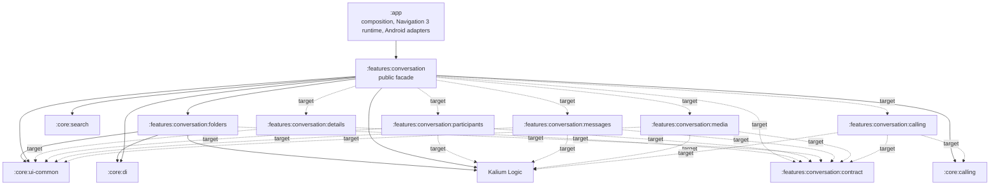

# Conversation module topology

**Status:** Staged implementation; folders is live and conversation calling, migration, banner state, message-user resolution, message-presentation models/primitives/resources/provider/system, message-click actions, link-preview visibility, author, reaction, regular-message leading, offline paging, self-deletion timer state and icon metrics, participant renderers/previews, regular, content, final and preview mapping/formatting, image/asset paging and asset-media/search state, empty-state and no-results rendering, role projection, media/search arguments, asset restrictions, guest-link action/information, record-audio information, muted-list presentation, and edit-metadata presentation have facade-owned seams
**Scope:** Conversation extraction after Navigation 3 migration
**Last verified:** 2026-08-25, `chore/android-modularization`, HEAD `0af9fc2de`

> The target topology is now partially live. `:features:conversation:folders` is the first internal capability, while the remaining conversation implementation stays in the Android-first `:features:conversation` facade.

## Purpose

Conversation is being extracted from `:app` so its presentation behaviour has a reusable feature owner on Android and can later become a Kotlin Multiplatform (KMP) candidate. The immediate objective is a safe Android migration. KMP is a design constraint, not a reason to introduce speculative source sets or abstractions.

The target contains a small public facade and internal capability modules. `:features:conversation` is the only conversation surface consumed by `:app`; the internal modules are implementation partitions, not a new family of reusable external features.



Solid edges are current declared Gradle dependencies. Dashed edges show permitted
target direction to modules that do not exist yet; they are not mandatory future
dependencies. Every capability takes only the smallest core, Kalium, or third-party
dependency it needs.

## Current transition model

Today `:features:conversation` is the migration facade and temporary owner for the capabilities not yet split. It re-exports `:features:conversation:folders` with an `api` edge, so `:app` continues to depend only on the facade. Folders owns its six package-preserving ViewModel/Metro sources, focused unit test, and 18 localized string entries; app retains folder screens, routes, Navigation 3 entries, and session binding installation.

Conversation info state and its ViewModel now belong to the facade. The feature accepts a platform-suitable `ConversationInfoViewModelArgs`; app keeps the `ConversationNavArgs` adapter, localized deleted-account label selection, unchanged Navigation 3 call, and one-time session binding installation. The `CurrentAccount` qualifier keeps its FQN but is physically owned by `:core:di`, allowing feature ViewModels to consume the composition qualifier without an app dependency.

Conversation call presentation orchestration is also facade-owned. `ConversationCallViewModel`, its dedicated assisted Metro gateway, and focused test live in `:features:conversation`; the assisted contract accepts only `ConversationId`. The facade has a direct `api` edge to `:core:calling` because the public `callManager` property exposes `JoinOrStartCallManager`. App keeps the route-facing `ConversationNavArgs` adapter, session binding installation, `JoinOrStartCallRuntimeActions`, and `JoinOrStartCallRuntimeDialogs`.

Conversation migration presentation follows the same narrow host seam. `ConversationMigrationViewModel`, its dedicated assisted Metro gateway, and focused test are facade-owned and accept only `ConversationId`. App retains the unchanged Navigation 3 call through a `ConversationNavArgs` adapter and installs the generated migration binding exactly once; no resource or dependency edge moved with it.

Conversation banner state follows that narrow host seam while keeping rendering in its existing owner. `ConversationBannerViewModel`, its dedicated assisted Metro gateway, focused test, and 95 localized state-message definitions are facade-owned; the assisted contract accepts only `ConversationId` and uses feature `R`. The definitions live in the feature's standard `strings.xml` files so the existing Crowdin source mapping covers every qualifier. App retains the `ConversationNavArgs` adapter, unchanged Navigation 3 call, one-time session binding installation, `ConversationScreen`, `ConversationBanner`, theme/runtime styling, and the four span-label IDs with their 23 localized definitions. Default, German, Spanish, and Russian carry all 15 state variants; Hungarian, Italian, Polish, Portuguese, and Sinhala carry the existing seven non-service variants, with no Swedish state entry.

Message-user resolution is facade-owned as well. `GetUsersForMessageUseCase` keeps its public package and FQN while resolving the sender and the exact additional-user sets carried by delivery failures, member changes, and legal-hold events. The projection remains private to that capability and is consumed by the facade-owned `MessageMapper`, so no new module edge or shared mapper abstraction is introduced.

Conversation role projection is facade-owned. `ObserveConversationRoleForUserUseCase` and `ConversationRoleData` keep their package and FQNs while projecting ordinary member roles and the same-team channel team-admin override from Kalium flows. `OtherUserProfileScreenViewModel`, `ServiceDetailsViewModel`, and their tests remain app-owned consumers through the existing facade edge; failed conversation details still produce no projection. No Gradle edge, resource, Metro contract, profile, navigation, or KMP source-set changes with this seam.

The conversation media and message-search arguments, paging use cases, and presentation state are facade-owned. `ConversationMediaNavArgs`, `SearchConversationMessagesNavArgs`, both paging use cases, `UIPagingItem`, `ConversationAssetMessagesViewModel`/state, and `SearchConversationMessagesViewModel`/state keep their packages, FQNs and behavior. Each ViewModel uses a dedicated feature-owned assisted Metro group/gateway; app session composition installs each generated binding once. The package-preserved search no-results renderer is feature-owned with its one ID and all seven exact localized definitions, while the app-owned route screen keeps the same FQN call. App Navigation 3 entries/mappers, profile descriptors, behavior tests, and host media adapters continue to consume the same contracts through the existing facade edge. No new Gradle/profile/stability/navigation-identity/KMP change accompanies this ownership move.

The package-preserved media empty-state renderer is facade-owned with its two dedicated labels
and all 14 existing definitions. Media screens still resolve runtime text and retain FileManager,
Cells, sharing, storage/permission, platform-picker, Navigation 3, and other Android host behavior.

Asset restriction presentation and its value-model closure are facade-owned. `CheckAssetRestrictionsViewModel`, `AssetTooLargeDialogState`, `AssetBundle`, `UriAsset`, `PathParceler`, and `ImportedMediaAsset` keep their packages, public FQNs, field/default contracts, and parcel encoding in `:features:conversation`. The feature owns the ordinary Metro binding and unchanged `checkAssetRestrictionsViewModel()` gateway; app installs that binding exactly once while retaining media import handling, screens, dialogs, and Navigation 3 runtime. No caller import, Gradle edge, resource, profile, stability, or KMP source changes with this move.

Message-presentation models, primitives, actions, chrome, resources, the resource provider, content/final-message mapping, preview mapping, offline paging transformation, and date formatting are facade-owned. The single existing `UIMessage` and `UIQuotedMessage` hierarchies, including quote-content mapping, keep their packages, FQNs, serializers, and defaults in `:features:conversation`; preview separators retain the exact HTML entity `"&nbsp;"` through a feature-private constant. The package-preserved sealed `MessageClickActions` contract and its `FullItem`/`Content` variants are feature-owned while all 12 existing app consumers retain the same FQN through the facade edge. The package-preserved `MessageBody.shouldHideStandalonePreviewedUrl` visibility rule is feature-owned and public because the app-owned `MessageContentAndStatus` renderer remains its sole consumer through the facade edge. The byte-identical, package-preserved `MessageAuthorRow`, `MessageSmallLabel`, `MessageReactionsItem`, and `RegularMessageItemLeading` composables are feature-owned; `ReactionPill` changes only from app `R` to feature `R`. The package-preserved `withOfflineIndicator` paging extension is public only for its remaining app ViewModel caller, while its message builder stays feature-internal and five focused cases are feature-owned. Existing app message-item consumers retain the same FQNs through the facade edge. `MessageDateTimeGroup` and its grouping/divider functions, the `Copyable` message contract, immutable `MarkdownNode`/`MarkdownPreview` data, the package-preserved `MessageResourceProvider`, `SystemMessageContentMapper`, `RegularMessageMapper`, `MessageContentMapper`, `MessageMapper`, `MessagePreviewContentMapper`, and `ISOFormatter` are feature-owned. Neutral `UiTextResolver` keeps its package/FQN in `:core:ui-common`. The feature owns all 59 message resource IDs with 608 definitions across their exact qualifiers and both reaction accessibility IDs with all 6 definitions across default, German, and Russian. App keeps Markdown parsing/rendering and remaining Compose/message-list rendering, while every consumer continues to use the same package-preserved contracts. No parallel model, chrome, action contract, mapper, formatter, or commonmark dependency is introduced.

Message status presentation is facade-owned. `MessageStatusIndicator` keeps its package/FQN and delivery-state behavior while using feature resources. The feature owns its three dedicated byte-identical drawables and all 34 existing localized definitions of the three accessibility IDs; the two drawables also consumed by app UI are neutral `:core:ui-common` resources.

Self-deletion timer state, formatting, and rendering are facade-owned. `MessageExpiration.kt`, its package/FQN and all 30 behavior tests move together with the ten plural IDs and all 65 original definitions. `MessageExpirationItems.kt` owns the timer/expired-message presentation plus four dedicated IDs and all 31 existing definitions; the absent Spanish definition continues to fall back to default. The app resolves its shared `unknown_user_name` label and passes the resulting `String` through the two existing caller branches. The timer and renderer otherwise read only neutral lifecycle/UI contracts and conversation-owned message state; no duplicate resource exists.

Self-deletion icon metrics are facade-owned with their seven Jupiter tests. The public `iconMetrics` extension remains the narrow seam for the app expiration renderer, while raw metric calculation is feature-internal. The renderer keeps only its unchanged private canvas start angle and stroke-width fraction; no rendering policy is exported from the feature.

The package-preserved `GroupConversationAvatar` is facade-owned because it renders feature-owned conversation avatar data through neutral core avatar primitives. Existing list and details callers keep the same FQN; no generic core component depends on the feature model.

Participant previews are facade-owned beside the existing runtime renderers and preview state. Their six preview functions keep their packages/FQNs and use the public neutral `MultipleThemePreviews` annotation; the app-internal preview annotation no longer crosses the module boundary.

Conversation-details UI consumes the package-preserved `SettingsOptionSwitch` and `SwitchState`
from `:core:ui-common`. The primitive is shared with app settings, new-conversation, and Cells;
its two labels and all 23 localized definitions are core-owned. This neutral prerequisite prevents
the details move from introducing a conversation-to-app dependency.

Group conversation options presentation is facade-owned. `GroupConversationOptions` keeps its
package/FQN, host callback surface, and behavior with 26 dedicated resource IDs and all 218
existing definitions. The reusable `GroupConversationOptionsItem`, `ArrowType`, and
`GroupOptionWithSwitch` shells are neutral UI-common primitives; the resource-backed disable
confirmation dialog stays in app. This preserves existing callers without a feature-to-app edge.

The package-preserved `SelfDeletingMessageOption` details renderer is facade-owned with its two
dedicated labels and all 13 existing definitions. It consumes the neutral options item shell and
changes only from app `R` to feature `R`.

The package-preserved `PasswordProtectedLinkBanner` guest-access renderer is facade-owned with
its two dedicated labels and all 15 existing definitions. Its app caller resolves the unchanged
FQN through the facade edge; the renderer otherwise uses only neutral UI-common presentation.

The package-preserved guest-link action button composables are facade-owned with their four
dedicated labels and all 45 existing definitions. App retains the guest-access screens,
clipboard/share intents, ViewModels, Navigation 3 runtime, and Metro assembly.

The package-preserved `RecordAudioInfoMessageType` is facade-owned with both record-failure IDs
and all 14 existing definitions. `EnabledMessageComposer` remains app-owned and uses the feature
resource only for its existing Android toast; recording side effects and permissions stay in app.

The package-preserved `MutedConversationBadge` is facade-owned with its accessibility label, all
17 existing definitions, and byte-identical `ic_mute`. App retains conversation-list factories
and the conversation bottom sheet; its remaining icon consumer uses the feature resource namespace.

The package-preserved `MessageBubbleItem` is facade-owned as the regular-message layout and interaction shell. It consumes conversation-owned models and the feature-owned click interceptor plus neutral theme/UI primitives; app callers retain the same FQN.

System-message leading presentation and the stable `SystemMessageContent` data contract are facade-owned. The package-preserved app system-message factory remains app-owned because it selects app resources; it constructs the unchanged feature contract through the existing facade edge.

Edit-conversation metadata presentation is facade-owned. `EditConversationMetadataViewModel`, its narrow state and validator, dedicated assisted Metro group/gateways, and focused test keep their packages and public FQNs in `:features:conversation`. App keeps the unchanged `GroupNameScreen`, its private edition-state adapter, Navigation 3 calls, and composition-root installation of the generated feature binding exactly once. Creation state and UI, resources, Gradle edges, profiles, Navigation 3 runtime, and KMP sources remain unchanged.

The image-asset paging closure is now facade-owned. `ObserveImageAssetMessagesFromConversationUseCase`, `UIAssetMapper`, `TimeZoneProvider`, `ConversationAssetMessagesViewModel`, its state and Metro gateway, and the focused paging test keep their packages and FQNs in `:features:conversation`; Paging 3 runtime is a direct public-API dependency and paging-testing remains test-only. `:app` retains media screens and navigation, the file-asset pipeline, platform pickers and permissions, and Android runtime composition.

- Feature-owned ViewModels, immutable UI state, use cases, pure mappers, local resources, and Metro gateway code may move into the current module.
- `:app` stays the composition root: Navigation 3 runtime registration, activities, services, providers, manifest declarations, flavor selection, app `BuildConfig`, and host-only side effects remain app-owned.
- Shared code moves first to neutral core when it has independent consumers; it never creates a conversation-to-feature dependency.
- Kotlin packages remain stable during moves to avoid import, navigation-identity, and review churn.

A further target submodule is created only after its seam is evidenced by source, resource, test, and dependency analysis. Package folders are not sufficient reason to create Gradle modules.

## Target responsibilities

| Target module | Owns | Does not own |
|---|---|---|
| `:features:conversation` facade | Stable public entry points and deliberately exported route/ViewModel contracts | App runtime composition, unrelated shared implementations |
| `:features:conversation:contract` | Platform-suitable arguments, results, immutable state contracts, capability interfaces, and small shared vocabulary | Navigation runtime, Compose screens, Metro session assembly, repositories, broad utilities |
| `:features:conversation:details` | Details/options/access/guest-access presentation state and ViewModels | Folder, media, or calling implementation copied for convenience |
| `:features:conversation:participants` | Participant aggregation, presentation models, typing/member state, and participant renderers | Generic people/search abstractions with independent consumers |
| `:features:conversation:folders` | List/create/move/select folder state, ViewModels, and feature resources | App Navigation 3 screen/result handling and global home composition |
| `:features:conversation:messages` | Timeline/detail state, actions, reactions/receipts, and message presentation use cases | Composer/list/gallery implementation until the cycle is intentionally broken |
| `:features:conversation:media` | Conversation gallery/media state, asset paths, media contracts | Platform pickers, permissions, activity results, or host runtime adapters |
| `:features:conversation:calling` | Conversation call presentation/orchestration using neutral calling contracts | Call activities/services, AVS rendering, analytics runtime choices, meetings implementation |

`contract` is intentionally narrow. A type belongs there only if at least two conversation capabilities need the same stable, platform-suitable contract, or it is part of the facade’s public API.

## Dependency law

```text
:app -> :features:conversation facade -> internal capability modules -> neutral core/Kalium
                                      -> :features:conversation:contract
```

Allowed:

- `:app -> :features:conversation` and app-to-neutral-core runtime-composition edges;
- facade-to-internal-module edges;
- an internal capability to `contract`, neutral core, Kalium, or the smallest required third-party API;
- `:features:conversation:calling -> :core:calling`.

Forbidden:

- Any feature (including an internal conversation module) to `:app`.
- Any external feature-to-feature edge, including meetings to conversation or an external feature to a conversation internal module.
- Direct implementation reuse between internal capabilities, for example `details -> participants` or `messages -> media`.
- `:core:calling` to app or any feature.
- App `R`, app `BuildConfig`, flavor implementations, Navigation 3 runtime, services, or activity code in an extracted capability.

When two independent features need a thing, extract the smallest stable contract or implementation to neutral core. `:core:calling` is the model: conversation uses it directly today; the meetings call state is still app-hosted and will add its own direct core edge only when it moves. Activities, services, dialogs, AVS, and flavor-selected analytics remain app runtime adapters.

## Extraction criteria and anti-junk-drawer rule

Create an internal target module only when all are true:

1. It owns a coherent capability, not a package prefix or a temporary build problem.
2. Its production, resource, test, Metro, and Navigation 3 closure is known and can move without `:app` or another feature.
3. Its dependency budget is explicit and minimal.
4. Metro factory/binding group, scope, keys, and navigation contract can be preserved, while app keeps runtime installation where needed.
5. Focused tests and source-ownership gates can prevent the old owner from returning.

Do not create `common`, `shared`, `utils`, `base`, or a catch-all `contract` module to silence an edge. A declaration moves to neutral core only for at least two independent consumers and a stable purpose; otherwise it stays with the capability that changes with it.

## Staged sequence

1. **Continue the facade migration.** Make small package-preserving moves into `:features:conversation`; screens, routes, and runtime assembly stay app-owned until their full closure is clean.
2. **Folders first — live.** `:features:conversation:folders` owns ConversationFolders, NewFolder, MoveConversationToFolder, their Metro gateways, focused test, and resources. The facade re-exports it and remains the only app dependency.
3. **Participants next.** Complete participant state/rendering and neutral shared label/type ownership. This becomes the candidate for `participants`; it is not exported to meetings.
4. **Details after explicit contracts.** Details uses the narrow contract and neutral types, never a direct participants dependency just to reuse a renderer or mapper.
5. **Messages and media later.** Treat messages, composer, conversation list, gallery/media, calling, and the app meetings host as a temporary source SCC. Break it through neutral ports and app adapters before creating `messages` or `media`; never replace the SCC with feature-to-feature chains.
6. **Conversation calling facade seam — live; internal split deferred.** The ViewModel and Metro gateway now consume `:core:calling` directly from the facade, while Android runtime adapters stay in app. Do not create `:features:conversation:calling` yet: the ViewModel also consumes the facade-owned `ObserveParticipantsForConversationUseCase`. First establish a participant capability/port that avoids an internal-module-to-facade dependency, then reassess the split.
7. **Split further internals only after the seams are demonstrated.** Introduce one capability module at a time; the facade remains the only supported inbound surface.

The order is capability-led, not directory-led. A smaller clean leaf may change the milestone, but never the dependency law.

## Android-first, KMP-ready contracts

KMP readiness preserves optionality:

- Put pure arguments, immutable state, IDs, result contracts, and capability interfaces in `contract` only when there is a real consumer boundary.
- Prefer Kotlin/JVM-compatible coroutine and serialization contracts. Do not expose Android `Bundle`, `Parcelable`, `Context`, resources, `SavedStateHandle`, activities, or services.
- Keep Compose and Android adaptation in Android capability modules until a shared target exists and its platform boundary is tested.
- Let app translate Navigation 3 runtime callbacks and flavor/BuildConfig values into feature contracts.
- Do not introduce `expect`/`actual`, KMP source sets, or iOS abstractions as scaffolding.

Package preservation is a review-friendly migration tactic, not a statement of final ownership.

## Review-friendly move procedure

1. Audit the full production, resource, test, Metro, and Navigation 3 closure before editing.
2. Use `git mv` for owned sources and preserve package names where possible.
3. Move only required localized resources; update app `R` imports to the destination module `R` and preserve all qualifiers.
4. Keep feature gateway/factory/binding declarations beside feature source; app session composition installs each feature binding once.
5. Leave app screens, routes, runtime adapters, and unrelated factory groups untouched.
6. Make neutral-core prerequisites their own small slice before a feature move.
7. Avoid incidental renames, formatting sweeps, behaviour changes, and Gradle edge additions.

A reviewer should primarily see source moves plus necessary import and assembly changes.

## Test and build gates

Every slice provides evidence proportional to its boundary:

- move and run focused unit tests from the destination owner;
- extend the owning module boundary test for package preservation, no app/parent implementation dependency, and the exact dependency budget;
- add an app assembly-ownership source test showing the old gateway/binding is absent, the feature gateway is present, and the session graph installs it exactly once;
- keep Navigation 3 source/contract tests green for app-owned routes and typed results;
- verify resource ownership and exact locale qualifier coverage;
- compile the feature and app development variant, plus relevant fdroid/nonfree variants when configuration or resources differ;
- run `git diff --check` and inspect name-status to confirm a move-first diff.

Stop and record a prerequisite if a slice needs app implementation access, an external feature edge, an unproven resource owner, a Metro scope/key change, or a Navigation 3 identity change. The remedy is a narrow neutral contract or app adapter—not weakening this topology.
