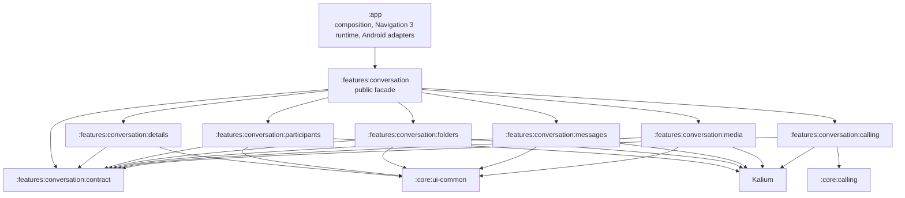

# Conversation module topology

**Status:** Staged implementation; folders is the first live internal capability
**Scope:** Conversation extraction after Navigation 3 migration

> The target topology is now partially live. `:features:conversation:folders` is the first internal capability, while the remaining conversation implementation stays in the Android-first `:features:conversation` facade.

## Purpose

Conversation is being extracted from `:app` so its presentation behaviour has a reusable feature owner on Android and can later become a Kotlin Multiplatform (KMP) candidate. The immediate objective is a safe Android migration. KMP is a design constraint, not a reason to introduce speculative source sets or abstractions.

The target contains a small public facade and internal capability modules. `:features:conversation` is the only conversation surface consumed by `:app`; the internal modules are implementation partitions, not a new family of reusable external features.



The graph shows permitted direction, not mandatory dependencies. Every capability takes only the smallest core, Kalium, or third-party dependency it needs.

## Current transition model

Today `:features:conversation` is the migration facade and temporary owner for the capabilities not yet split. It re-exports `:features:conversation:folders` with an `api` edge, so `:app` continues to depend only on the facade. Folders owns its six package-preserving ViewModel/Metro sources, focused unit test, and 18 localized string entries; app retains folder screens, routes, Navigation 3 entries, and session binding installation.

- Feature-owned ViewModels, immutable UI state, use cases, pure mappers, local resources, and Metro gateway code may move into the current module.
- `:app` stays the composition root: Navigation 3 runtime registration, activities, services, providers, manifest declarations, flavor selection, app `BuildConfig`, and host-only side effects remain app-owned.
- Shared code moves first to neutral core when it has independent consumers; it never creates a conversation-to-feature dependency.
- Kotlin packages remain stable during moves to avoid import, navigation-identity, and review churn.

A further target submodule is created only after its seam is evidenced by source, resource, test, and dependency analysis. Package folders are not sufficient reason to create Gradle modules.

## Target responsibilities

| Target module | Owns | Does not own |
|---|---|---|
| `:features:conversation` facade | Stable public entry points and deliberately exported route/ViewModel contracts | App runtime composition, unrelated shared implementations |
| `:features:conversation:contract` | Platform-suitable arguments, results, immutable state contracts, capability interfaces, and small shared vocabulary | Navigation runtime, Compose screens, Metro session assembly, repositories, broad utilities |
| `:features:conversation:details` | Details/options/access/guest-access presentation state and ViewModels | Folder, media, or calling implementation copied for convenience |
| `:features:conversation:participants` | Participant aggregation, presentation models, typing/member state, and participant renderers | Generic people/search abstractions with independent consumers |
| `:features:conversation:folders` | List/create/move/select folder state, ViewModels, and feature resources | App Navigation 3 screen/result handling and global home composition |
| `:features:conversation:messages` | Timeline/detail state, actions, reactions/receipts, and message presentation use cases | Composer/list/gallery implementation until the cycle is intentionally broken |
| `:features:conversation:media` | Conversation gallery/media state, asset paths, media contracts | Platform pickers, permissions, activity results, or host runtime adapters |
| `:features:conversation:calling` | Conversation call presentation/orchestration using neutral calling contracts | Call activities/services, AVS rendering, analytics runtime choices, meetings implementation |

`contract` is intentionally narrow. A type belongs there only if at least two conversation capabilities need the same stable, platform-suitable contract, or it is part of the facade’s public API.

## Dependency law

```text
:app -> :features:conversation facade -> internal capability modules -> neutral core/Kalium
                                      -> :features:conversation:contract
```

Allowed:

- `:app -> :features:conversation` and app-to-neutral-core runtime-composition edges;
- facade-to-internal-module edges;
- an internal capability to `contract`, neutral core, Kalium, or the smallest required third-party API;
- `:features:conversation:calling -> :core:calling`.

Forbidden:

- Any feature (including an internal conversation module) to `:app`.
- Any external feature-to-feature edge, including meetings to conversation or an external feature to a conversation internal module.
- Direct implementation reuse between internal capabilities, for example `details -> participants` or `messages -> media`.
- `:core:calling` to app or any feature.
- App `R`, app `BuildConfig`, flavor implementations, Navigation 3 runtime, services, or activity code in an extracted capability.

When two independent features need a thing, extract the smallest stable contract or implementation to neutral core. `:core:calling` is the model: conversation and meetings use it directly; activities, services, dialogs, AVS, and flavor-selected analytics remain app runtime adapters.

## Extraction criteria and anti-junk-drawer rule

Create an internal target module only when all are true:

1. It owns a coherent capability, not a package prefix or a temporary build problem.
2. Its production, resource, test, Metro, and Navigation 3 closure is known and can move without `:app` or another feature.
3. Its dependency budget is explicit and minimal.
4. Metro factory/binding group, scope, keys, and navigation contract can be preserved, while app keeps runtime installation where needed.
5. Focused tests and source-ownership gates can prevent the old owner from returning.

Do not create `common`, `shared`, `utils`, `base`, or a catch-all `contract` module to silence an edge. A declaration moves to neutral core only for at least two independent consumers and a stable purpose; otherwise it stays with the capability that changes with it.

## Staged sequence

1. **Continue the facade migration.** Make small package-preserving moves into `:features:conversation`; screens, routes, and runtime assembly stay app-owned until their full closure is clean.
2. **Folders first — live.** `:features:conversation:folders` owns ConversationFolders, NewFolder, MoveConversationToFolder, their Metro gateways, focused test, and resources. The facade re-exports it and remains the only app dependency.
3. **Participants next.** Complete participant state/rendering and neutral shared label/type ownership. This becomes the candidate for `participants`; it is not exported to meetings.
4. **Details after explicit contracts.** Details uses the narrow contract and neutral types, never a direct participants dependency just to reuse a renderer or mapper.
5. **Messages and media later.** Treat messages, composer, conversation list, gallery/media, calling, and the app meetings host as a temporary source SCC. Break it through neutral ports and app adapters before creating `messages` or `media`; never replace the SCC with feature-to-feature chains.
6. **Conversation calling last.** Move only conversation presentation/orchestration once it consumes `:core:calling` directly. Android call runtime stays in app.
7. **Split further internals only after the seams are demonstrated.** Introduce one capability module at a time; the facade remains the only supported inbound surface.

The order is capability-led, not directory-led. A smaller clean leaf may change the milestone, but never the dependency law.

## Android-first, KMP-ready contracts

KMP readiness preserves optionality:

- Put pure arguments, immutable state, IDs, result contracts, and capability interfaces in `contract` only when there is a real consumer boundary.
- Prefer Kotlin/JVM-compatible coroutine and serialization contracts. Do not expose Android `Bundle`, `Parcelable`, `Context`, resources, `SavedStateHandle`, activities, or services.
- Keep Compose and Android adaptation in Android capability modules until a shared target exists and its platform boundary is tested.
- Let app translate Navigation 3 runtime callbacks and flavor/BuildConfig values into feature contracts.
- Do not introduce `expect`/`actual`, KMP source sets, or iOS abstractions as scaffolding.

Package preservation is a review-friendly migration tactic, not a statement of final ownership.

## Review-friendly move procedure

1. Audit the full production, resource, test, Metro, and Navigation 3 closure before editing.
2. Use `git mv` for owned sources and preserve package names where possible.
3. Move only required localized resources; update app `R` imports to the destination module `R` and preserve all qualifiers.
4. Keep feature gateway/factory/binding declarations beside feature source; app session composition installs each feature binding once.
5. Leave app screens, routes, runtime adapters, and unrelated factory groups untouched.
6. Make neutral-core prerequisites their own small slice before a feature move.
7. Avoid incidental renames, formatting sweeps, behaviour changes, and Gradle edge additions.

A reviewer should primarily see source moves plus necessary import and assembly changes.

## Test and build gates

Every slice provides evidence proportional to its boundary:

- move and run focused unit tests from the destination owner;
- extend the owning module boundary test for package preservation, no app/parent implementation dependency, and the exact dependency budget;
- add an app assembly-ownership source test showing the old gateway/binding is absent, the feature gateway is present, and the session graph installs it exactly once;
- keep Navigation 3 source/contract tests green for app-owned routes and typed results;
- verify resource ownership and exact locale qualifier coverage;
- compile the feature and app development variant, plus relevant fdroid/nonfree variants when configuration or resources differ;
- run `git diff --check` and inspect name-status to confirm a move-first diff.

Stop and record a prerequisite if a slice needs app implementation access, an external feature edge, an unproven resource owner, a Metro scope/key change, or a Navigation 3 identity change. The remedy is a narrow neutral contract or app adapter—not weakening this topology.
